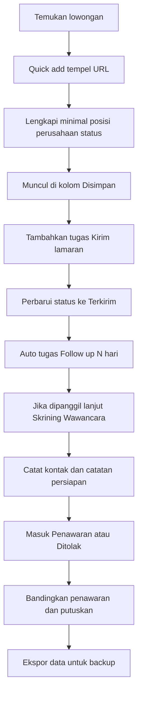
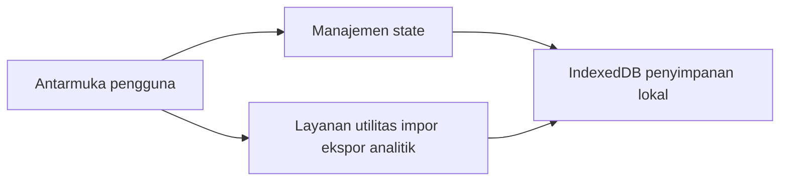
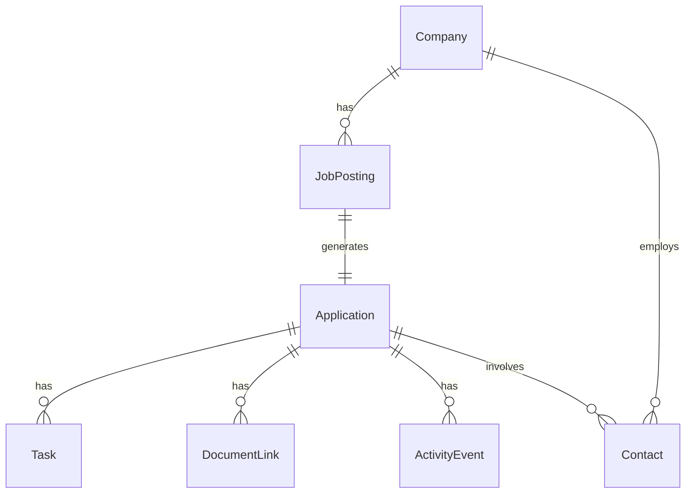
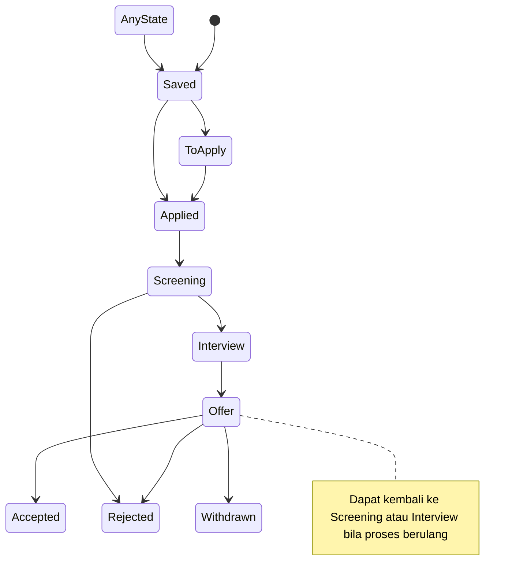

# FRD FSD: JobTrack Personal Job Application Tracker

| Dokumen | Keterangan |
| :--- | :--- |
| Tipe | Functional Requirements Document dan Functional Specification Document gabungan |
| Status | Draft untuk Review |
| Versi | 1.0 MVP |
| Sumber PRD | PRD.md |
| Target Pengguna | Individu pencari kerja single user |
| Inspirasi | trakerja com, jobtracker id |

---

## 1. Ringkasan dan Ruang Lingkup

Aplikasi lokal first untuk membantu individu melacak lowongan dan proses lamaran. MVP menekankan pencatatan cepat, pipeline visual, tugas dan pengingat, pencarian filter, ekspor impor, dan analitik sederhana. Semua data disimpan di perangkat pengguna menggunakan IndexedDB agar privasi terjaga.

Dalam dokumen ini:
- FRD menguraikan kebutuhan fungsional dari sudut pandang pengguna dan kriteria penerimaan.
- FSD merinci spesifikasi solusi teknis meliputi arsitektur, model data, aturan bisnis, alur UX, dan non fungsional.

Kesesuaian dengan PRD
- Sasaran pengguna, masalah, dan metrik mengikuti PRD
- Fitur MVP identik dengan cakupan In Scope pada PRD

---

## 2. FRD Functional Requirements

### 2.1 Modul Fitur MVP

1) Simpan Lowongan
- Input minimal posisi, perusahaan, status awal
- Opsi URL sumber, lokasi, tipe kerja, rentang gaji, batas akhir, deskripsi singkat atau kata kunci, tag
- Quick add dengan paste URL menyimpan link lebih dulu, tanpa parsing wajib di MVP
- Hasil simpan muncul di papan sesuai kolom status default

2) Pipeline Board dan List
- Tahapan default Disimpan, Siap Dilamar, Terkirim, Skrining, Wawancara, Penawaran, Diterima, Ditolak, Mengundurkan Diri
- Board kanban drag and drop dan List tabel
- Kartu menampilkan perusahaan, posisi, hari sejak aktivitas terakhir, indikator tugas aktif

3) Tugas dan Pengingat
- Tipe tugas Kirim Lamaran, Follow up, Wawancara, Tugas Tes, Thank you note
- Field due date, waktu opsional, prioritas Low Med High, status Belum Selesai
- Agenda harian mingguan dan highlight keterlambatan

4) Catatan Dokumen dan Kontak
- Catatan bebas per lamaran dan perusahaan
- Tautan dokumen CV versi, cover letter, portofolio atau upload file lokal jika diizinkan browser
- Kontak rekruter nama, peran, email, telepon, LinkedIn dan catatan interaksi

5) Pencarian dan Filter
- Berdasarkan status, perusahaan, posisi, kata kunci, sumber, lokasi, tipe kerja, rentang gaji, tanggal temuan, deadline, tag
- Sortir berdasarkan terbaru, deadline, prioritas, nama perusahaan

6) Ekspor dan Impor
- Ekspor seluruh data ke JSON dan CSV
- Impor file cadangan untuk pemulihan data

7) Analitik Dasar
- Jumlah lamaran per periode
- Rasio konversi antar tahap
- Rata rata waktu di setiap tahap
- Sumber situs teratas berdasar respons atau progres

8) Privasi dan Penyimpanan
- Tanpa akun wajib pada MVP
- Semua data di IndexedDB perangkat
- Fitur backup restore melalui ekspor impor

### 2.2 User Stories dan Acceptance Criteria

US 01 Simpan Lowongan Cepat
- Sebagai pelamar, saya ingin menyimpan informasi lowongan dengan cepat agar tidak kehilangan jejak
- Kriteria
  - Bisa tempel URL sumber lowongan
  - Field wajib posisi, perusahaan, status awal
  - Field opsional URL, lokasi, tipe kerja, gaji, deadline, deskripsi, tag
  - Setelah simpan, item muncul di kolom Disimpan atau kolom yang dipilih

US 02 Kelola Pipeline Visual
- Sebagai pelamar, saya ingin memindahkan tahapan lamaran secara visual agar mengetahui progres
- Kriteria
  - Tersedia 9 tahapan default
  - Board drag and drop dan List tabel
  - Kartu menampilkan ringkasan penting dan indikator tugas

US 03 Tugas dan Pengingat
- Sebagai pelamar, saya ingin mencatat dan diperingatkan atas aktivitas rekrutmen agar tidak terlambat
- Kriteria
  - Dapat membuat tugas dengan tipe, due date, prioritas, status
  - Agenda menyorot tugas lewat jatuh tempo

US 04 Dokumen dan Kontak
- Sebagai pelamar, saya ingin mencatat versi CV dan data HR agar komunikasi konsisten
- Kriteria
  - Menyimpan catatan versi CV cover dan tautan portofolio
  - Menyimpan kontak HR lengkap dengan catatan

US 05 Ekspor Impor Data
- Sebagai pengguna, saya ingin mencadangkan dan memulihkan seluruh data
- Kriteria
  - Ekspor JSON dan CSV berisi semua entitas terkait
  - Impor memulihkan data tanpa kehilangan relasi pada struktur kompatibel

### 2.3 Non Fungsional Ringkas
- Local first IndexedDB, tanpa backend pada MVP
- Responsif mobile first
- Performa pencarian filter cepat pada ribuan entri
- Lokal waktu Asia Jakarta, format tanggal konsisten
- Aksesibilitas dasar keyboard dan ARIA

### 2.4 Alur UX Utama

Mermaid flowchart untuk alur inti



---

## 3. FSD Functional Specification

### 3.1 Arsitektur Sistem
- Aplikasi web single page lokal first
- UI layer komponen reaktif untuk Board List Agenda Detail
- State management klien untuk entitas dan filter
- Penyimpanan IndexedDB dengan skema terstruktur dan migrasi versi
- Opsi PWA offline cache pasca MVP

Diagram arsitektur



### 3.2 Model Data dan Entitas

Entitas inti dan field utama

- JobPosting
  - id string uuid
  - title string wajib
  - companyId string referensi Company
  - sourceUrl string opsional
  - foundDate date opsional
  - applyDeadline date opsional
  - location string opsional
  - workType enum onsite hybrid remote opsional
  - salaryMin number opsional
  - salaryMax number opsional
  - tags string array opsional
  - keywords string opsional
  - createdAt datetime
  - updatedAt datetime

- Company
  - id string uuid
  - name string wajib
  - industry string opsional
  - size string opsional
  - website string opsional
  - location string opsional
  - linkedinUrl string opsional
  - notes string opsional
  - createdAt datetime
  - updatedAt datetime

- Application
  - id string uuid
  - jobPostingId string referensi JobPosting
  - stage enum Saved ToApply Applied Screening Interview Offer Accepted Rejected Withdrawn
  - dateApplied date opsional
  - expectedSalary number opsional
  - benefits string opsional
  - referral boolean opsional
  - referralContactId string opsional
  - notes string opsional
  - lastActivityAt datetime
  - createdAt datetime
  - updatedAt datetime

- Task
  - id string uuid
  - applicationId string referensi Application
  - type enum Apply FollowUp Interview Assignment ThankYou
  - title string wajib
  - dueDate datetime opsional
  - priority enum Low Med High default Med
  - status enum Open Done default Open
  - snoozeUntil datetime opsional
  - createdAt datetime
  - updatedAt datetime

- Contact
  - id string uuid
  - companyId string referensi Company opsional
  - applicationId string referensi Application opsional
  - name string wajib
  - role string opsional
  - email string opsional
  - phone string opsional
  - linkedinUrl string opsional
  - notes string opsional
  - createdAt datetime
  - updatedAt datetime

- DocumentLink
  - id string uuid
  - applicationId string referensi Application
  - label string contoh CV v2 Cover Letter v1 Portofolio
  - url string atau file handle
  - createdAt datetime

- ActivityEvent
  - id string uuid
  - applicationId string referensi Application
  - type enum Created StageChanged TaskAdded TaskDone NoteEdited ContactAdded OfferRecorded
  - at datetime
  - payload object opsional metadata

Relasi tingkat tinggi



### 3.3 Status dan State Machine

Daftar tahap
- Saved, ToApply, Applied, Screening, Interview, Offer, Accepted, Rejected, Withdrawn

Aturan transisi
- Bebas maju mundur kecuali Accepted Rejected Withdrawn adalah terminal
- Perubahan status mencatat ActivityEvent StageChanged dan memperbarui lastActivityAt

Diagram state



### 3.4 Desain Penyimpanan IndexedDB

- Nama basis data jobtrack mvp v1
- Object store dan kunci
  - companies keyPath id, index name
  - jobPostings keyPath id, index companyId, index title, index applyDeadline
  - applications keyPath id, index jobPostingId, index stage, index lastActivityAt
  - tasks keyPath id, index applicationId, index status, index dueDate
  - contacts keyPath id, index companyId, index applicationId, index name
  - documents keyPath id, index applicationId
  - activities keyPath id, index applicationId, index type, index at
- Migrasi versi menambahkan index baru tanpa menghapus data

### 3.5 Spesifikasi UI dan Komponen

Tampilan utama
- Board Kanban kolom per tahap, kartu ringkas, drag and drop, counter per kolom
- List tabel kolom perusahaan, posisi, status, deadline, tugas aktif, sort filter
- Detail aplikasi tab Ringkasan, Tugas, Dokumen, Kontak, Catatan, Riwayat
- Agenda daftar tugas harian mingguan dengan filter status dan prioritas
- Form tambah edit lowongan dengan validasi minimal
- Panel filter global tag, status, periode tanggal, sumber, lokasi, tipe kerja

Komponen kunci
- CardApplication ringkas dengan badge tugas dan umur aktivitas
- ModalTask dengan tipe preset dan tanggal
- FilterPills untuk cepat mengaktifkan menonaktifkan filter
- ExportImportPanel dengan instruksi dan validasi file

### 3.6 Aturan Bisnis dan Validasi
- Wajib title dan company name saat membuat JobPosting Application
- Stage default Saved bila tidak dipilih
- Saat stage berubah ke Applied, tawarkan membuat tugas Follow up otomatis N hari default 3
- Tugas dengan dueDate lampau ditandai overdue dan dinaikkan prioritas visual
- Hapus entitas melakukan soft delete flag deletedAt bila diperlukan pasca MVP

### 3.7 Analitik dan Definisi Metrik
- Applications per period hitung berdasarkan createdAt atau dateApplied
- Conversion rate antar tahap hitung jumlah transisi StageChanged per pasangan tahap dibagi total di tahap asal
- Average time in stage hitung selisih waktu antar StageChanged berturut per aplikasi lalu rata rata
- Top sources agregasi berdasarkan domain dari sourceUrl dengan outcome minimal mencapai Screening atau lebih

### 3.8 Ekspor dan Impor Spesifikasi

JSON
- Satu berkas berisi arrays untuk setiap entitas, termasuk metadata versi
- Contoh struktur singkat

```json
{
  "version": "1.0",
  "exportedAt": "2026-09-11T12:00:00Z",
  "companies": [ { "id": "uuid", "name": "PT Example" } ],
  "jobPostings": [ { "id": "uuid", "title": "Frontend", "companyId": "uuid" } ],
  "applications": [ { "id": "uuid", "jobPostingId": "uuid", "stage": "Applied" } ],
  "tasks": [],
  "contacts": [],
  "documents": [],
  "activities": []
}
```

CSV
- Satu berkas per entitas dengan header kolom standar
- applications csv kolom id, jobPostingId, stage, dateApplied, expectedSalary, benefits, referral, referralContactId, notes, lastActivityAt, createdAt, updatedAt

Validasi impor
- Wajib version kompatibel
- Referensi id yang hilang menimbulkan peringatan dan entri ditandai orphan untuk resolusi manual

### 3.9 Lokal Waktu Notifikasi
- Semua tanggal disimpan UTC, ditampilkan dalam zona Asia Jakarta
- Pengingat native notifikasi browser hanya saat PWA tersedia pasca MVP, sementara gunakan agenda harian

### 3.10 Performa dan Batasan
- Target render interaksi kolom dan drag di bawah 16ms frame budget
- Query filter pada 1k hingga 5k entri di bawah 100ms dengan index tepat

### 3.11 Aksesibilitas
- Navigasi keyboard penuh pada board dan list
- Kontras warna sesuai pedoman
- ARIA role pada komponen interaktif

### 3.12 Penanganan Error
- Gagal baca tulis IndexedDB tampilkan panduan peramban dan opsi ekspor darurat jika memungkinkan
- Impor file tidak valid tampilkan daftar error baris dan opsi abaikan baris bermasalah

### 3.13 Keamanan dan Privasi
- Data tetap di perangkat pengguna, tidak dikirim ke server pada MVP
- Dokumen sensitif disarankan berupa tautan cloud milik pengguna
- Jangan menyimpan kredensial situs pekerjaan

### 3.14 Telemetri Opsional
- Selama MVP, tidak ada pelacakan eksternal
- Jika kelak diaktifkan, hanya event anonim agregat seperti jumlah item dipindah antar kolom

### 3.15 Fitur Opsional Pasca MVP
- Parsing halaman situs kerja populer untuk prefill
- PWA offline cache dan push notification
- ICS feed untuk tugas wawancara
- Ekstensi peramban untuk quick capture
- Perbandingan penawaran dengan kalkulator ringkas konteks Indonesia

### 3.16 Pemetaan Uji Penerimaan Singkat
- US 01 Simpan Lowongan Cepat uji input minimal dan muncul di board
- US 02 Pipeline Visual uji drag and drop serta perubahan status terekam
- US 03 Tugas uji pembuatan tipe tugas dan highlight overdue
- US 04 Dokumen Kontak uji simpan dan tampil di detail
- US 05 Ekspor Impor uji round trip data tanpa kehilangan

### 3.17 Rencana Rilis
- MVP meliputi seluruh modul 2.1 poin 1 hingga 8
- Fase 1.1 menambahkan parsing, template follow up, perbandingan penawaran, versi CV cover tracking
- Fase 1.2 menambahkan PWA, ICS, ekstensi, insight sederhana

---

## 4. Lampiran

Contoh tag dan filter umum
- Role Frontend Backend Data Product Design
- Tipe kerja Remote Hybrid Onsite
- Sumber LinkedIn Jobstreet Kalibrr Glints Lainnya

Kamus istilah singkat
- Pipeline urutan tahap proses rekrutmen
- Overdue tugas melewati tanggal jatuh tempo
- Local first data disimpan lokal lebih dulu tanpa server
