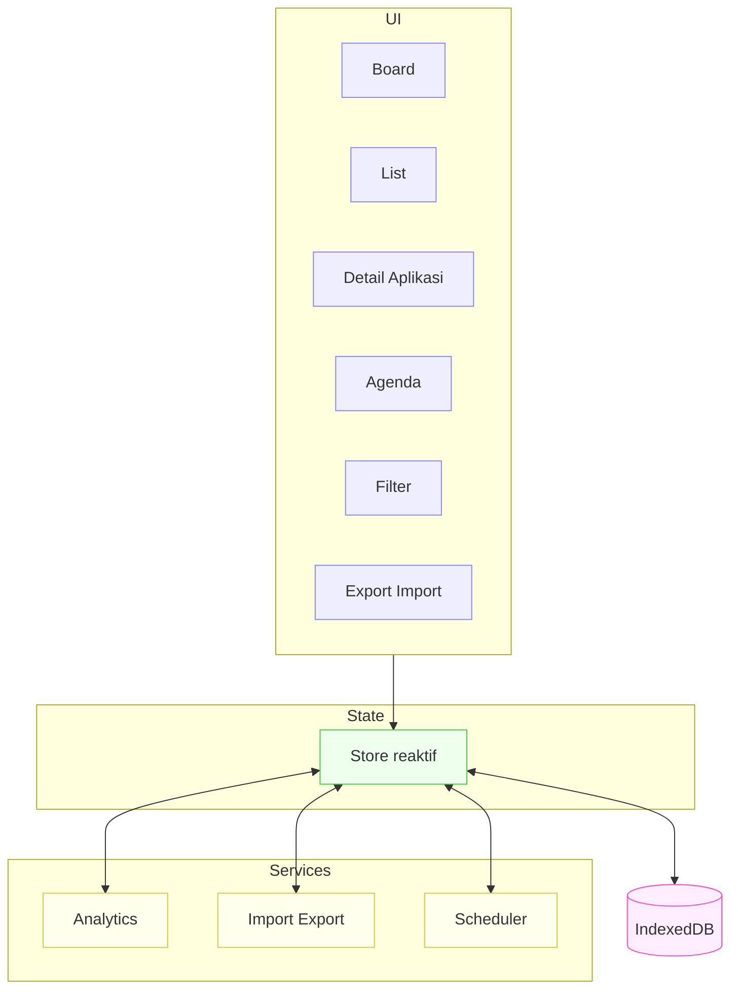
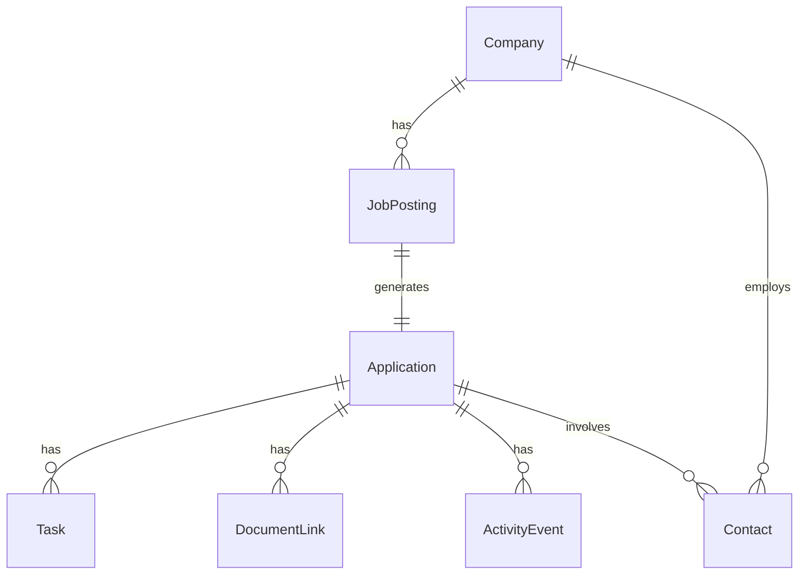
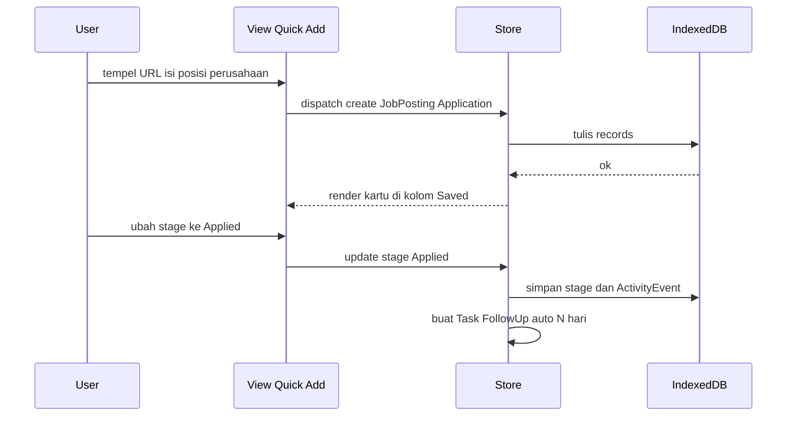
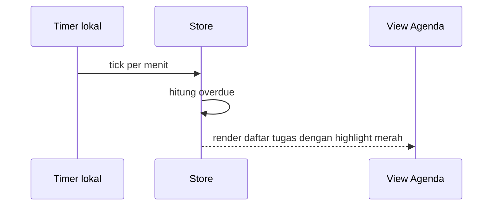

# System Architecture: JobTrack Personal Tracker

Status: Draft for Review
Versi: 1.0 MVP
Relasi Dokumen: PRD lihat [PRD.md](PRD.md), FRD FSD lihat [FRD-FSD.md](FRD-FSD.md), Standar Desain & Kode lihat [`anti-slop.md`](anti-slop.md)

---

## 1. Ringkas

Tujuan: local first SPA untuk lacak lowongan dan lamaran single user. Tanpa backend pada MVP. Data aman di perangkat via IndexedDB. Ekspor impor untuk backup. Fokus performa cepat, UI responsif, dan privasi.

Prinsip desain
- Local first dahulu, sinkronisasi nanti
- Native web dulu: HTML CSS TypeScript, IndexedDB
- Minimal dependensi, modul kecil, mudah dirawat
- Aksesibilitas, mobile first, timezone Asia Jakarta

---

## 2. Konteks Sistem

Aktor dan batas sistem

```mermaid
flowchart LR
  U[Pengguna] --> W[JobTrack Web App]
  W -->|baca tulis| L[IndexedDB Lokal]
  W -->|ekspor impor| F[Berkas JSON CSV]
  U -->|buka URL lowongan| S[Situs Lowongan eksternal]
  note right of L
    Data pribadi disimpan lokal
  end note
```

---

## 3. Arsitektur Logis

Lapisan
- UI Views: Board, List, Detail, Agenda, Search Filter, Export Import
- State: store global app untuk entitas, filter, UI state
- Services: analytics, import export, scheduler reminder, id generator
- Storage: IndexedDB adapter, migrasi skema, query berindeks

Diagram



---

## 4. Model Data Tingkat Tinggi

Entitas inti: Company, JobPosting, Application, Task, Contact, DocumentLink, ActivityEvent.

ER ringkas



Indeks disarankan
- applications: stage, lastActivityAt, jobPostingId
- tasks: applicationId, status, dueDate
- jobPostings: companyId, title, applyDeadline
- contacts: companyId, applicationId, name

---

## 5. Alur Utama

5.1 Quick Add sampai Apply



5.2 Agenda dan Overdue



---

## 6. Desain Penyimpanan IndexedDB

Database: jobtrack mvp v1

Object store
- companies keyPath id, index name
- jobPostings keyPath id, index companyId title applyDeadline
- applications keyPath id, index jobPostingId stage lastActivityAt
- tasks keyPath id, index applicationId status dueDate
- contacts keyPath id, index companyId applicationId name
- documents keyPath id, index applicationId
- activities keyPath id, index applicationId type at

Migrasi
- Tambah index baru via onupgradeneeded, tanpa drop data
- Simpan nomor versi skema pada metadata

---

## 7. UI dan Navigasi

- App shell dengan header pencarian global, tab Board List Agenda
- Router hash sederhana untuk rute board, list, agenda, detail aplikasi by id
- Drag and drop pada Board, keyboard fallback via tombol pindah tahap
- List gunakan virtual list bila item banyak

---

## 8. Teknologi dan Alat

- Bahasa: TypeScript DOM API, CSS modern
- Build: Vite
- UI: komponen ringan tanpa framework besar atau pilih satu ringan setara
- DnD: native HTML5 dnd ditambah util ringan bila perlu
- IndexedDB: wrapper util tipis di atas IDB native
- Test ringan: assert util untuk perhitungan analitik waktu per tahap

ponytail: Boleh ganti ke framework komponen bila kompleksitas UI naik; tambah idb lib jika API native terlalu verbose.

---

## 9. Non Fungsional

- Performa: interaksi board 60fps, query filter 100ms pada 1k 5k entri
- Responsif: mobile first 360px hingga desktop besar
- I18n: tanggal waktu tampil Asia Jakarta, simpan UTC
- Aksesibilitas: fokus terlihat, role ARIA, navigasi keyboard

---

## 10. Keamanan dan Privasi

- Data lokal saja, tidak kirim ke server pada MVP
- Dokumen simpan sebagai tautan milik pengguna
- Hindari menyimpan kredensial situs kerja
- Ekspor JSON CSV disimpan oleh pengguna

---

## 11. Ekspor Impor

- Ekspor satu berkas JSON plus CSV per entitas
- Validasi saat impor: versi skema kompatibel, referensi hilang jadi orphan untuk resolusi manual

---

## 12. Observability dan Error

- Tidak ada telemetri eksternal pada MVP
- Error IndexedDB tampilkan panduan peramban dan ajak ekspor darurat bila mungkin
- Impor gagal tampilkan daftar baris error

---

## 13. Rencana Evolusi Pasca MVP

- PWA offline cache dan notifikasi
- Parsing halaman situs kerja populer untuk prefill
- ICS feed untuk agenda wawancara
- Opsi sinkronisasi cloud terenkripsi end to end atau akun opsional

---

## 14. Risiko dan Mitigasi

- Risiko kehilangan data jika cache peramban dibersihkan
  - Mitigasi: edukasi backup ekspor berkala, pengingat ringan
- Kompleksitas IDB API
  - Mitigasi: wrapper util tipis, uji menyeluruh operasi CRUD
- Performa list besar
  - Mitigasi: index tepat, virtual list, batching render

---

## 15. Lampiran

Definisi tahap pipeline
- Saved, ToApply, Applied, Screening, Interview, Offer, Accepted, Rejected, Withdrawn

Mapping tampilan ke entitas
- Board List: Application, JobPosting
- Detail: Application, Task, Contact, DocumentLink, ActivityEvent
- Agenda: Task
- Export Import: semua entitas
