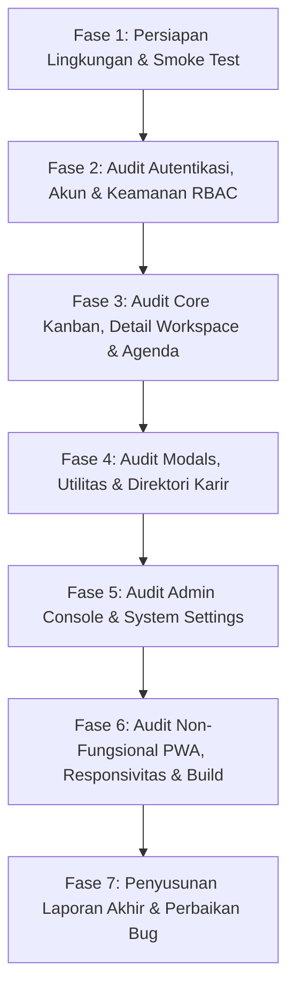

# Master Plan Audit Komprehensif JobTrackId (Frontend & Backend)

> **Dokumen Perencanaan Audit Kualitas, Fungsionalitas, Keamanan, & UX**  
> **Status:** Menunggu Persetujuan Eksekusi (Ready for Execution)  
> **Target Aplikasi:** JobTrackId (Web Application: Single Page Application + Express REST API)  
> **Lingkungan Pengujian:** Development / Staging (`localhost:5173` & `localhost:3000`)

---

## 1. Pendahuluan & Tujuan Audit

Audit ini dirancang untuk melakukan evaluasi menyeluruh (end-to-end audit) terhadap seluruh halaman, alur kerja (*user flows*), endpoint API, komponen UI, sistem keamanan, dan mekanisme latar belakang (*background workers*) pada platform **JobTrackId**.

### Sasaran Utama Audit:
1. **Fungsionalitas & Konsistensi:** Memastikan seluruh fitur berjalan tanpa regresi, bug logika, maupun *broken links*.
2. **Keamanan & Otorisasi:** Menguji keandalan autentikasi JWT, proteksi RBAC (USER vs SUPERADMIN), pencegahan IDOR (*Insecure Direct Object Reference*), rate limiting, serta penanganan token kedaluwarsa.
3. **Integritas Data:** Memvalidasi operasi CRUD, kaskade penghapusan (*soft-delete* vs *permanent-delete*), validasi skema (Zod & Prisma), dan sinkronisasi status Kanban.
4. **UX & Responsivitas:** Menguji kenyamanan antarmuka pada berbagai resolusi layar (Desktop, Tablet, Mobile), konsistensi desain, feedback visual (toast/loading state), dan aksesibilitas keyboard.
5. **Kinerja & Stabilitas:** Memverifikasi performa build, *hot-reload*, efisiensi kueri database, serta penanganan kesalahan (*error boundary & crash reporting*).

---

## 2. Cakupan Modul & Matriks Pengujian

Audit dibagi menjadi **9 Modul Utama** yang mencakup 100% fitur dan halaman aplikasi:

```
┌─────────────────────────────────────────────────────────────────────────────┐
│                       CAKUPAN MASTER AUDIT JOBTRACKID                       │
├──────────────────────────────┬──────────────────────────────┬───────────────┤
│ MODUL PENGGUNA               │ MODUL PRODUKTIVITAS          │ MODUL ADMIN   │
├──────────────────────────────┼──────────────────────────────┼───────────────┤
│ 1. Autentikasi & Akun        │ 4. Jadwal & Agenda Kalender  │ 8. Dedicated  │
│ 2. Kanban Board & Pelacakan  │ 5. Direktori & Eksplorasi    │    Admin Work-│
│ 3. Workspace Detail Lamaran  │ 6. Modals & Kalkulator Fin.  │    space      │
│                              │ 7. Profil & Keamanan Akun    │ 9. Arsitektur │
│                              │                              │    & PWA      │
└──────────────────────────────┴──────────────────────────────┴───────────────┘
```

---

### Modul 1: Autentikasi, Registrasi & Kontrol Akses
**Komponen:** `frontend/src/components/AuthPage.ts`, `frontend/src/components/auth/*`, `backend/src/routes/auth.ts`, `backend/src/routes/google-auth.ts`, `backend/src/middleware/auth.ts`

| No | Kasus Uji | Skenario Pengujian | Hasil yang Diharapkan |
|:---|:---|:---|:---|
| 1.1 | Pendaftaran Akun Baru | Input data valid (nama, email unik, password kuat). | Akun terdaftar, email verifikasi terkirim, token tersimpan di store. |
| 1.2 | Validasi Form Registrasi | Input email duplikat, password kurang dari 8 karakter, format email salah. | Tampil pesan error spesifik dan form menolak submit. |
| 1.3 | Login Kredensial Standar | Login dengan password yang tepat vs salah. | Berhasil login dan redirect ke `/app`, atau tampil pesan error kredensial salah. |
| 1.4 | Alur Lupa Password | Request link reset password ke email, simulasi token valid vs kedaluwarsa. | Email instruksi terkirim; tautan reset dapat mengubah kata sandi dengan aman. |
| 1.5 | Google OAuth Sign-In | Inisialisasi alur OAuth ke endpoint Google API dan penanganan callback. | Profil akun terhubung, pembuatan session JWT yang sah. |
| 1.6 | Manajemen Sesi & Token Refresh | Akses API dengan access token kadaluwarsa (<15m) menggunakan refresh token. | Silent refresh berjalan mulus tanpa memaksa pengguna login ulang secara mendadak. |
| 1.7 | Pembatasan Rute Terproteksi | Mengakses `/app` dan `/admin` tanpa token atau dengan role yang tidak memadai. | Redirect otomatis ke halaman login atau menampilkan error 403 Forbidden. |

---

### Modul 2: Core Tracker (Kanban Board & List View)
**Komponen:** `frontend/src/components/BoardView.ts`, `frontend/src/components/ListView.ts`, `frontend/src/components/QuickAddModal.ts`, `backend/src/routes/applications.ts`

| No | Kasus Uji | Skenario Pengujian | Hasil yang Diharapkan |
|:---|:---|:---|:---|
| 2.1 | Quick Add Application | Menambahkan lamaran baru via modal cepat dengan format gaji dan nama perusahaan. | Lamaran tersimpan di DB, kartu langsung muncul di kolom stage yang dipilih (default: Saved). |
| 2.2 | Deteksi Duplikasi Lamaran | Menambahkan posisi yang identik pada perusahaan yang sama dalam rentang 30 hari. | Dialog peringatan duplikasi muncul dengan opsi tinjau lamaran lama atau tetap lanjutkan. |
| 2.3 | Drag and Drop Antar Kolom | Memindahkan kartu dari satu tahap (misal: *Applied*) ke tahap lain (*Interview*). | Animasi mulus, perubahan status tersinkronisasi ke API `PATCH /applications/:id/stage`, counter kolom terupdate. |
| 2.4 | Filter & Pencarian Kartu | Filter berdasarkan sistem kerja (*Remote, Hybrid, Onsite*), kata kunci nama perusahaan/posisi. | Kartu pada papan terfilter secara instan tanpa reload halaman. |
| 2.5 | Sortir & Urutan Kartu | Urutkan berdasarkan tanggal lamaran terbaru, deadline terdekat, atau nama perusahaan. | Kartu tertata sesuai kriteria sortir yang aktif. |
| 2.6 | Tampilan Tabel (List View) | Beralih dari tampilan Kanban ke List View. | Data konsisten dengan papan Kanban, paginasi berjalan, aksi cepat (edit/delete) berfungsi. |
| 2.7 | Empty State Handling | Membuka kolom atau filter yang tidak memiliki data lamaran sama sekali. | Tampilan placeholder visual yang informatif dengan CTA untuk menambah lamaran. |

---

### Modul 3: Workspace Detail Lamaran (Application Detail View)
**Komponen:** `frontend/src/components/ApplicationDetailView.ts`, `frontend/src/components/detail/*`, `backend/src/routes/interviews.ts`, `backend/src/routes/documents.ts`, `backend/src/routes/contacts.ts`

| No | Kasus Uji | Skenario Pengujian | Hasil yang Diharapkan |
|:---|:---|:---|:---|
| 3.1 | Tab Ringkasan & Edit Info | Mengubah deskripsi lowongan, rentang gaji penawaran, lokasi kantor, dan catatan khusus. | Perubahan tersimpan ke database dan tercatat dalam linimasa aktivitas. |
| 3.2 | Persiapan Wawancara (STAR Hub) | Mencatat simulasi wawancara dengan format *Situation, Task, Action, Result* serta bank soal. | Catatan tersimpan terstruktur per sesi wawancara, dapat diedit dan di-export/print. |
| 3.3 | Manajemen Dokumen & CV | Menghubungkan CV spesifik, berkas portofolio, atau cover letter ke lamaran. | Dokumen terhubung dengan benar, tautan preview/unduh dapat diakses. |
| 3.4 | Buku Kontak Recruiter | Menambahkan kontak HRD/User (nama, email, no HP/LinkedIn) pada lamaran terkait. | Kontak tersimpan, tombol direct email / WhatsApp / LinkedIn shortcut berfungsi. |
| 3.5 | To-Do & Task Checklist | Menambahkan checklist persiapan teknis atau tugas sebelum wawancara dengan deadline. | Status checklist tercentang, terintegrasi dengan reminder agenda. |
| 3.6 | Linimasa Riwayat Aktivitas | Memeriksa riwayat perpindahan tahapan dan aktivitas lamaran sejak dibuat. | Seluruh transisi tercatat dengan *timestamp* akurat. |

---

### Modul 4: Jadwal, Agenda & Sinkronisasi Kalender
**Komponen:** `frontend/src/components/AgendaView.ts`, `backend/src/routes/events.ts`, `backend/src/services/googleCalendarService.ts`, `backend/src/workers/reminderCron.ts`

| No | Kasus Uji | Skenario Pengujian | Hasil yang Diharapkan |
|:---|:---|:---|:---|
| 4.1 | Pembuatan Jadwal Acara | Menambahkan event wawancara/tes teknis dengan tanggal, waktu mulai, dan link Google Meet/Zoom. | Event tampil pada daftar agenda harian/mingguan dan kalender. |
| 4.2 | Deteksi Jadwal Bertabrakan | Membuat dua acara wawancara pada rentang waktu yang tumpang tindih (*overlap*). | Peringatan bentrok jadwal (*conflict badge*) muncul sebelum konfirmasi. |
| 4.3 | Integrasi Google Calendar | Sinkronisasi jadwal event ke Google Calendar pengguna yang telah menghubungkan akun. | Event terbuat di Google Calendar pengguna beserta link meeting dan reminder. |
| 4.4 | Background Reminder Worker | Pengujian worker cron (setiap 15 menit) untuk memeriksa jadwal dalam 24 jam ke depan. | Notifikasi email pengingat terkirim ke pengguna sesuai preferensi reminder. |

---

### Modul 5: Direktori Karir & Eksplorasi Lowongan
**Komponen:** `frontend/src/components/CareerLinksView.ts`, `frontend/src/components/CompaniesView.ts`, `frontend/src/components/JobsView.ts`, `backend/src/routes/companies.ts`, `backend/src/routes/career-links.ts`, `backend/src/routes/jobs.ts`

| No | Kasus Uji | Skenario Pengujian | Hasil yang Diharapkan |
|:---|:---|:---|:---|
| 5.1 | Pencarian Direktori Perusahaan | Pencarian dari basis data 8.000+ perusahaan (BUMN, Perbankan, FMCG, Tech, Energi). | Hasil pencarian cepat (<300ms), filter kategori dan sektor industri berfungsi akurat. |
| 5.2 | Bookmark Link Karir Favorit | Menandai perusahaan sebagai bintang/favorit. | Status favorit tersimpan per user, muncul di tab khusus dan profil pengguna. |
| 5.3 | Halaman Cari Lowongan (Empty State) | Membuka halaman Cari Lowongan setelah pengosongan dataset dummy. | Menampilkan status "Belum Ada Lowongan Tersedia" yang rapi dengan link portal eksternal. |
| 5.4 | Tautan Portal Eksternal | Klik link menuju portal resmi (JobStreet, Glints, LinkedIn, KarirHub). | Membuka tautan eksternal di tab baru dengan atribut `rel="noopener noreferrer"`. |

---

### Modul 6: Modals Utilitas & Akselerator Produktivitas
**Komponen:** `frontend/src/components/SalaryCalculatorModal.ts`, `frontend/src/components/OfferComparisonModal.ts`, `frontend/src/components/EmailTemplatesModal.ts`, `frontend/src/components/ImportModal.ts`, `frontend/src/components/CommandPalette.ts`

| No | Kasus Uji | Skenario Pengujian | Hasil yang Diharapkan |
|:---|:---|:---|:---|
| 6.1 | Kalkulator Pajak PPh 21 TER 2024 | Input gaji kotor, status PTKP (TK/0 s.d K/3), dan komponen BPJS. | Perhitungan akurat sesuai PP 58/2023, menampilkan rincian *take-home pay* bersih. |
| 6.2 | Modal Komparasi Penawaran | Membandingkan 2 atau lebih penawaran kerja (gaji pokok, bonus, tunjangan, benefit WFH). | Skor perbandingan terhitung otomatis, grafik visual mudah dipahami. |
| 6.3 | Generator Template Email HRD | Memilih skenario email (Follow-up lamaran, Konfirmasi jadwal, Negosiasi gaji, Thank you note). | Variabel posisi & perusahaan terisi otomatis, tombol copy-to-clipboard berfungsi. |
| 6.4 | Import Data (CSV/Excel) | Mengunggah file CSV/Excel daftar lamaran kerja dari template yang disediakan. | Data ter-parse dengan benar, validasi baris gagal vs sukses, penambahan masal ke DB. |
| 6.5 | Export Data Riwayat | Melakukan export seluruh data pelacakan lamaran ke format JSON dan Excel. | File terunduh lengkap dengan seluruh detail tahapan dan riwayat catatan. |
| 6.6 | Command Palette (`Ctrl+K`) | Membuka command palette via shortcut keyboard atau klik ikon pencarian. | Navigasi instan ke halaman manapun, eksekusi aksi cepat tambah lamaran/kalkulator. |

---

### Modul 7: Profil, Pengaturan Akun & Trash Bin
**Komponen:** `frontend/src/components/ProfileView.ts`, `frontend/src/components/profile/*`, `frontend/src/components/TrashView.ts`, `backend/src/routes/trash.ts`

| No | Kasus Uji | Skenario Pengujian | Hasil yang Diharapkan |
|:---|:---|:---|:---|
| 7.1 | Perubahan Profil & Avatar | Mengubah nama tampilan, nomor telepon, dan target gaji karir. | Profil terupdate, avatar inisial langsung berubah di header. |
| 7.2 | Ganti Kata Sandi | Input password lama yang benar/salah dan konfirmasi password baru. | Password terenkripsi dengan bcrypt, verifikasi password lama wajib lolos. |
| 7.3 | Manajemen Sesi Aktif | Melihat daftar sesi/perangkat login aktif dan mencabut (*revoke*) sesi lain. | Sesi yang dicabut langsung terblokir dari akses API berikutnya. |
| 7.4 | Hubungkan Google Calendar | Menghubungkan atau memutuskan integrasi akun Google dari tab profil. | Status integrasi ter-toggle, token tersimpan aman atau dihapus saat diskoneksi. |
| 7.5 | Mekanisme Trash (Soft Delete) | Menghapus lamaran dari Kanban board. | Lamaran tidak langsung hilang permanen, masuk ke Trash Bin dengan timestamp 30 hari. |
| 7.6 | Pemulihan & Hapus Permanen di Trash | Mengembalikan (*restore*) lamaran ke status asalnya atau menghapus secara permanen. | Lamaran kembali ke papan Kanban atau terhapus total dari database beserta kaskadenya. |

---

### Modul 8: Dedicated Admin Portal (`/admin`)
**Komponen:** `frontend/src/admin.ts`, `frontend/src/adminRouter.ts`, `frontend/src/components/admin/*`, `backend/src/routes/admin.ts`

| No | Kasus Uji | Skenario Pengujian | Hasil yang Diharapkan |
|:---|:---|:---|:---|
| 8.1 | Proteksi Guard Admin Portal | Mengakses `/admin` dengan akun role `USER` biasa vs `SUPERADMIN`. | User biasa ditolak/diredirect ke `/app`; SUPERADMIN diizinkan masuk ke panel admin. |
| 8.2 | Telemetri & Crash Reporting | Uji pengiriman laporan crash client-side via `/api/v1/telemetry/report`. | Error tercatat di tabel `systemErrorLog` dan muncul di tab Telemetri admin. |
| 8.3 | Manajemen Pengguna & RBAC | Mengubah role user (USER <-> ADMIN), reset status verifikasi email, blokir akun. | Perubahan peran tersimpan di DB dan tercatat pada audit log. |
| 8.4 | Audit Log Trail | Melakukan aksi administratif (ubah setting/role) dan periksa tab Audit Log. | Seluruh histori aksi administratif terekam dengan IP, payload, dan timestamp. |
| 8.5 | Mode Pemeliharaan (Maintenance) | Mengaktifkan toggle *Maintenance Mode* dari dashboard admin. | Pengguna publik melihat layar maintenance, sementara admin tetap dapat mengakses sistem. |
| 8.6 | Siaran Pengumuman Global | Membuat banner pengumuman dengan warna tema (info/warning/success) dan teks khusus. | Banner siaran langsung muncul di bagian paling atas aplikasi frontend publik. |
| 8.7 | Pemantau Background Workers | Memeriksa tab Workers untuk status reminder cron job dan kesehatan queue. | Menampilkan uptime, status eksekusi terakhir, dan metrik keberhasilan worker. |
| 8.8 | Penguji SMTP / Mail Tester | Mengirim email uji coba dari panel admin ke alamat email tujuan. | Email test terkirim melalui SMTP yang terkonfigurasi, log pengiriman tampil transparan. |

---

### Modul 9: Arsitektur, Kualitas Kode, PWA & Responsivitas
**Komponen:** `frontend/public/sw.js`, `frontend/public/manifest.webmanifest`, `backend/src/middleware/*`, `frontend/src/styles/*`

| No | Kasus Uji | Skenario Pengujian | Hasil yang Diharapkan |
|:---|:---|:---|:---|
| 9.1 | Validasi Build Frontend & Backend | Menjalankan `npm run build` dari root workspace. | TypeScript compiler & Vite bundler selesai tanpa error maupun warning fatal. |
| 9.2 | Responsivitas Antarmuka | Uji tampilan pada viewport Mobile (375px), Tablet (768px), dan Desktop (1440px). | Layout shell menyesuaikan (drawer navigasi bawah/samping), tidak ada horizontal scroll liar. |
| 9.3 | PWA & Service Worker | Memeriksa registrasi service worker dan manifest web app di browser DevTools. | Status PWA valid, icon terload, banner install dapat dipicu pada browser mobile. |
| 9.4 | Central Error Handling & Rate Limit | Mengirim payload cacat ke API dan memicu batasan request berulang dalam waktu singkat. | API merespons dengan JSON standar `{ error: string }` dan HTTP status yang tepat (400, 429, 500). |
| 9.5 | Keamanan Header & Sanitasi | Memeriksa implementasi Helmet, CORS headers, dan sanitasi input HTML untuk mencegah XSS. | Header keamanan aktif (`X-Content-Type-Options`, `Content-Security-Policy`), script injeksi ter-escape. |

---

## 3. Rubrik Klasifikasi & Prioritas Temuan

Setiap temuan (*finding*) dari hasil audit akan diklasifikasikan ke dalam 4 tingkatan severitas:

| Tingkat Severitas | Kriteria & Dampak | Batas Penanganan |
|:---|:---|:---|
| 🔴 **CRITICAL** | Kerentanan keamanan, kebocoran data, kegagalan autentikasi, crash sistem total, data korup. | Wajib diperbaiki segera sebelum rilis. |
| 🟠 **HIGH** | Fitur utama tidak berfungsi, alur kerja krusial terputus, sinkronisasi gagal tanpa recovery. | Harus diselesaikan dalam siklus audit ini. |
| 🟡 **MEDIUM** | Inkonsistensi UI/UX, validasi input minor, pesan error kurang informatif, keterlambatan respons. | Diperbaiki setelah prioritas High selesai. |
| 🔵 **LOW / POLISH** | Minor cosmetic styling, penataan margin/padding, perbaikan typo, peningkatan micro-interaction. | Peningkatan kualitas visual (*enhancement*). |

---

## 4. Rencana Tahapan Eksekusi Audit (Roadmap)



1. **Fase 1:** Verifikasi lingkungan pengujian (Database aktif, Backend & Frontend listening, konfigurasi `.env`).
2. **Fase 2:** Eksekusi pengujian Modul 1 (Autentikasi & RBAC).
3. **Fase 3:** Eksekusi pengujian Modul 2, 3, & 4 (Kanban, Detail Lamaran, Agenda).
4. **Fase 4:** Eksekusi pengujian Modul 5, 6, & 7 (Direktori, Modals, Profil, Trash).
5. **Fase 5:** Eksekusi pengujian Modul 8 (Dedicated Admin Workspace).
6. **Fase 6:** Pengujian Modul 9 (Build, PWA, Responsivitas seluler, Header keamanan).
7. **Fase 7:** Konsolidasi temuan ke dalam berkas laporan audit lengkap (`AUDIT_REPORT.md`) beserta rekomendasi perbaikan terperinci.

---

### Konfirmasi Lanjutan:
Rencana audit di atas telah disusun secara komprehensif. Setelah rencana ini disetujui, audit akan segera dieksekusi secara sistematis tahap demi tahap.
