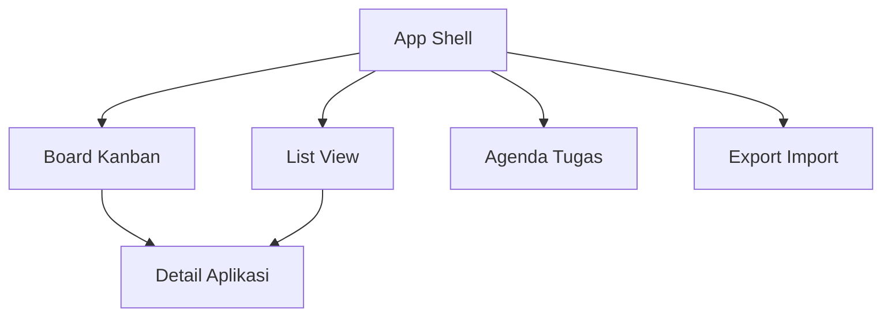
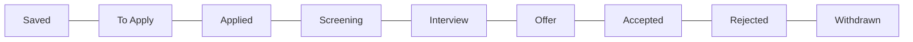
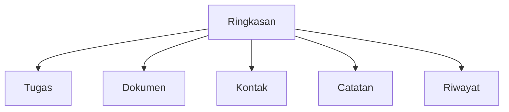

# Wireframes: JobTrack MVP

Status: Draft for Review
Relasi Dokumen: Lihat [PRD.md](PRD.md), [FRD-FSD.md](FRD-FSD.md), [architecture.md](architecture.md), [`anti-slop.md`](anti-slop.md)

Tujuan: Menyajikan sketsa tampilan utama dan komponen untuk MVP single user local first. Fokus ke kejelasan alur, hierarki informasi, dan elemen UI inti. Warna dan gaya visual tidak ditetapkan di dokumen ini.

---

## 1. Prinsip Desain
- Mobile first, desktop adaptive
- Satu fokus per layar, beban kognitif rendah
- Navigasi jelas melalui tab Board, List, Agenda, Export
- Akses cepat: Quick Add selalu tersedia
- Pencarian dan Filter mudah dijangkau
- Indikator overdue dan status terlihat
- Prinsip visual anti-slop: padat informasi, tanpa gradasi ungu, tanpa kartu berbayang tebal (lihat [`anti-slop.md`](anti-slop.md))

---

## 2. Sitemap dan Navigasi Global



App Shell
- AppBar: Search, tombol Add, menu
- Tab Bar: Board, List, Agenda, Export
- Filter Drawer: panel kanan atau kiri

---

## 3. App Shell

Sketsa Desktop

```
+----------------------------------------------------------------------------------+
| AppBar: [Search................................]  + Add   Filter  Menu           |
+----------------------------------------------------------------------------------+
| Tabs:  Board | List | Agenda | Export                                            |
+----------------------------------------------------------------------------------+
| Filter Drawer |                          Content Area                            |
| [Status]      |                                                                  |
| [Tags]        |                                                                  |
| [Date Range]  |                                                                  |
| [Work Type]   |                                                                  |
| [Source]      |                                                                  |
+----------------------------------------------------------------------------------+
```

Sketsa Mobile

```
+--------------------------------------+
| AppBar: [S..]  +                     |
+--------------------------------------+
| Board | List | Agenda | ⋮            |
+--------------------------------------+
| Content                                 
|                                         
+--------------------------------------+
| Floating Filter   Floating Add          |
+--------------------------------------+
```

Catatan
- Floating action Add untuk cepat input pada mobile
- Filter sebagai bottom sheet atau drawer

---

## 4. Board Kanban

Tujuan: Visual pipeline, drag and drop antar tahap, ringkasan kartu

Mermaid Struktur Blok



Sketsa Desktop

```
+----------------------------------------------------------------------------------+
| Board                                                                          ^ |
+---------------------+---------------------+---------------------+-----------------+
| Saved (3)           | To Apply (2)        | Applied (5)         | Screening (1)   |
| + Add card          |                     |                     |                 |
| [PT A | FE]   ••    | [PT C | BE]   !     | [PT X | DS]         | [PT Z | PM]  !  |
| [PT B | QA]         | [PT D | UI]         | [PT Y | FE]   •     |                 |
| ...                 | ...                 | ...                 | ...             |
+---------------------+---------------------+---------------------+-----------------+
| Interview (1)       | Offer (1)           | Accepted (0)        | Rejected (4)    |
| [PT M | SRE]   •    | [PT N | FE]         |                     | [PT Q | QA]     |
+---------------------+---------------------+---------------------+-----------------+
Legend: ! overdue tugas, • ada tugas aktif, •• baru diupdate                                          
```

Kartu Aplikasi
- Header: Company • Position
- Badges: tugas aktif, overdue, hari sejak update
- Footer kecil: deadline, sumber

Interaksi
- Drag and drop antar kolom
- Klik kartu membuka Detail
- + Add card di kolom untuk membuat langsung dengan stage kolom tersebut

---

## 5. List View

Tujuan: Tabel padat dengan sort dan filter

Sketsa Desktop

```
+----------------------------------------------------------------------------------+
| List                                                                            ^ |
+----------------------------------------------------------------------------------+
| Company        | Position     | Stage       | Deadline   | Tasks | Updated       |
| PT Alpha       | Frontend     | Applied     | 12 09      | 1 !   | 2d            |
| PT Beta        | QA           | Screening   | -          | 0     | 5h            |
| PT Gamma       | Backend      | To Apply    | 15 09      | 2     | 1d            |
| ...                                                                              |
+----------------------------------------------------------------------------------+
Actions per row: View Detail, Move Stage, Add Task, More
```

Sketsa Mobile

```
[Company • Position]
Stage • Deadline • Tasks
Updated
[Actions]
```

---

## 6. Detail Aplikasi

Tab: Ringkasan, Tugas, Dokumen, Kontak, Catatan, Riwayat

Mermaid Struktur Tab



Sketsa Desktop

```
+----------------------------------------------------------------------------------+
| Detail PT Alpha • Frontend                               Stage: Applied  [Edit]  |
+----------------------------------------------------------------------------------+
| Ringkasan | Tugas | Dokumen | Kontak | Catatan | Riwayat                         |
+----------------------------------------------------------------------------------+
| Ringkasan                                                                      ^ |
| - Posisi: Frontend                                                              |
| - Perusahaan: PT Alpha  Sumber: linkedin com job 123                            |
| - Lokasi: Jakarta  Work Type: Hybrid                                            |
| - Deadline: 15 09  Salary: 10 15jt                                              |
| - Terakhir aktif: 2 hari                                                        |
| [Tombol] Pindah Tahap  Tambah Tugas  Tambah Dokumen                             |
+----------------------------------------------------------------------------------+
```

Tab Tugas

```
+----------------------------+
| + Tambah Tugas             |
+----------------------------+
| [Follow up] Due 14 09   !  |
| [Interview] Due 16 09      |
+----------------------------+
```

Tab Dokumen

```
CV v2 Google Drive [Buka]
Cover Letter v1 [Buka]
Portofolio [Buka]
+ Tambah Dokumen
```

Tab Kontak

```
Nama  Peran    Email           Telepon     LinkedIn
Sari  HR       sari@alpha id   08xxx       linkedin com in sari
+ Tambah Kontak
```

Tab Catatan

```
[ Text area catatan bebas ]
Simpan
```

Tab Riwayat

```
12 09 StageChanged Applied
12 09 TaskAdded Follow up
13 09 NoteEdited Ringkasan
```

---

## 7. Quick Add Modal

Tujuan: Input cepat minimal

Sketsa

```
+---------------- Quick Add ----------------+
| Posisi           [______________]         |
| Perusahaan       [______________]         |
| URL Sumber       [______________]         |
| Status awal      [Saved v]                |
| [ Batal ]                    [ Simpan ]   |
+------------------------------------------+
```

Opsi Lanjutan Tersembunyi
- Lokasi, Work Type, Deadline, Tags

---

## 8. Agenda Tugas

Tujuan: Daftar tugas harian mingguan, highlight overdue

Sketsa Desktop

```
+----------------------------------------------------------------------------------+
| Agenda                                                                         ^ |
+----------------------------------------------------------------------------------+
| Filter: [All Tasks v] [This Week v] [Priority v]                                 |
+----------------------------------------------------------------------------------+
| 14 09 Jumat                                                                      |
| - Follow up PT Alpha    Due 09 00   !   [Done] [Snooze] [Open App]               |
| - Siapkan Interview PT Beta  Due 15 00   [Done] [Snooze] [Open App]              |
| 15 09 Sabtu                                                                      |
| - Interview PT Beta      10 00       [Open App]                                  |
+----------------------------------------------------------------------------------+
```

---

## 9. Export Import

Sketsa

```
+-----------------------------------------------+
| Export Import                                 |
+-----------------------------------------------+
| Export                                        |
| [ Export JSON ]  [ Export CSV Zip ]           |
|                                               |
| Import                                        |
| [ Pilih Berkas ]  jobtrack backup json        |
| [ Import ]                                    |
| Catatan kompatibilitas versi skema            |
+-----------------------------------------------+
```

---

## 10. Filter Drawer

Sketsa

```
+---------------- Filters ----------------+
| Status         [Any v]                  |
| Tags           [ + Tag ]                |
| Source         [LinkedIn][Kalibrr]      |
| Work Type      [Remote][Hybrid][Onsite] |
| Date Found     [____ to ____]           |
| Deadline       [____ to ____]           |
| Apply          [ Terapkan ]             |
| Reset          [ Reset ]                |
+----------------------------------------+
```

---

## 11. Empty States

Board kosong
- Teks ajakan tambah lowongan
- Tombol Quick Add

List kosong
- Saran gunakan pencarian atau hapus filter ketat

Agenda kosong
- Teks semua tugas selesai

---

## 12. Aksesibilitas dan Ring UI

- Fokus terlihat pada tab, kartu, tombol aksi
- Ukuran target sentuh minimal 44x44 px
- Navigasi keyboard: Tab antar kolom, Enter buka detail, panah untuk pindah

---

## 13. Anotasi Data pada UI

Badge dan indikator
- Overdue: tanda seru merah pada kartu dan baris
- Tasks count: angka kecil di kartu dan list
- Last activity: teks relatif 5h 2d

---

## 14. Varian Desktop vs Mobile

- Board: di mobile gunakan satu kolom layar dan swipe antar kolom
- List: kartu kompak tiga baris
- Detail: tab menjadi segmen horizontal scrollable

---

## 15. Checklist Kesesuaian FRD FSD

- Board kolom sesuai 9 tahap default
- Quick Add minimal 3 field wajib
- Agenda menampilkan overdue jelas
- Detail menyediakan tab Tugas Dokumen Kontak Catatan Riwayat
- Export Import ada pada tab khusus

---

## 16. Lampiran

Ikon yang disarankan
- Add plus, Filter funnel, Stage arrow right, Overdue exclamation, Done check

Teks placeholder
- Search lowongan perusahaan posisi
